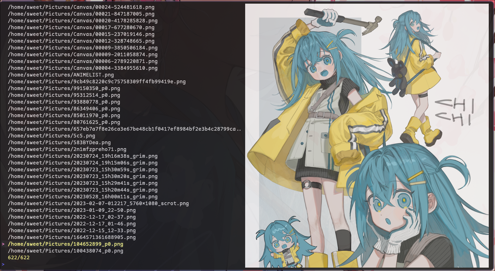

# Fzf-Image

A simple implementation of Fzf that specializes in picking images.
So far only Kitty is supported (PR's welcome for Sixel, iTerm, Chafa etc...)
Fzf is not a dependency of this project, fzfimg uses a go-fzf which is an implementation
of Fzf not related to the original project.

How to run:

fzfimg accepts a list of images separated by newlines on standard in. It accepts all image formats
that kitty's icat supports.

Preview:

### this software is still in early development!
